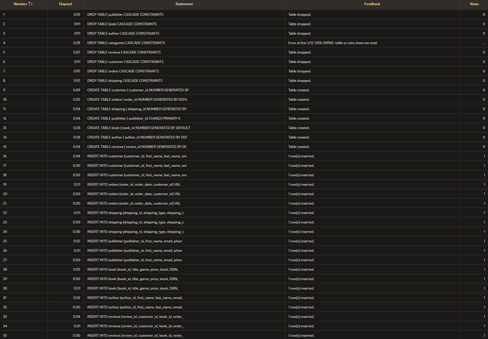

<h1>Library Database</h1>

<h2>Description</h2>
This project was an assignment for my Intro to Data Analytics class, I was to create an SQL script from scratch for a Library Database.  
 

<h2>Languages and Utilities Used</h2>

- <b>SQL</b> 
- <b>Apex Oracle</b>

<h2>Environments Used </h2>

- <b>Windows 11</b> 
